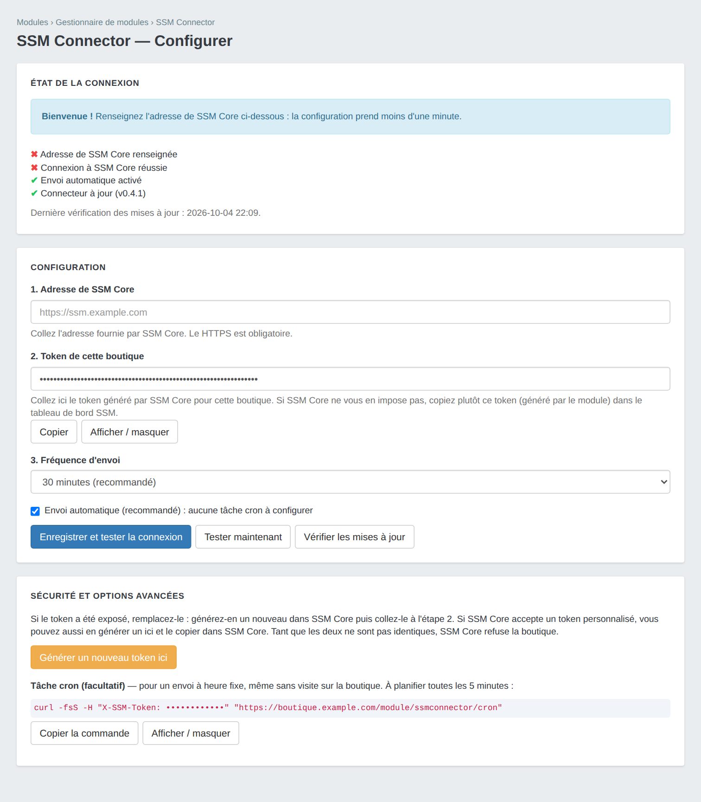
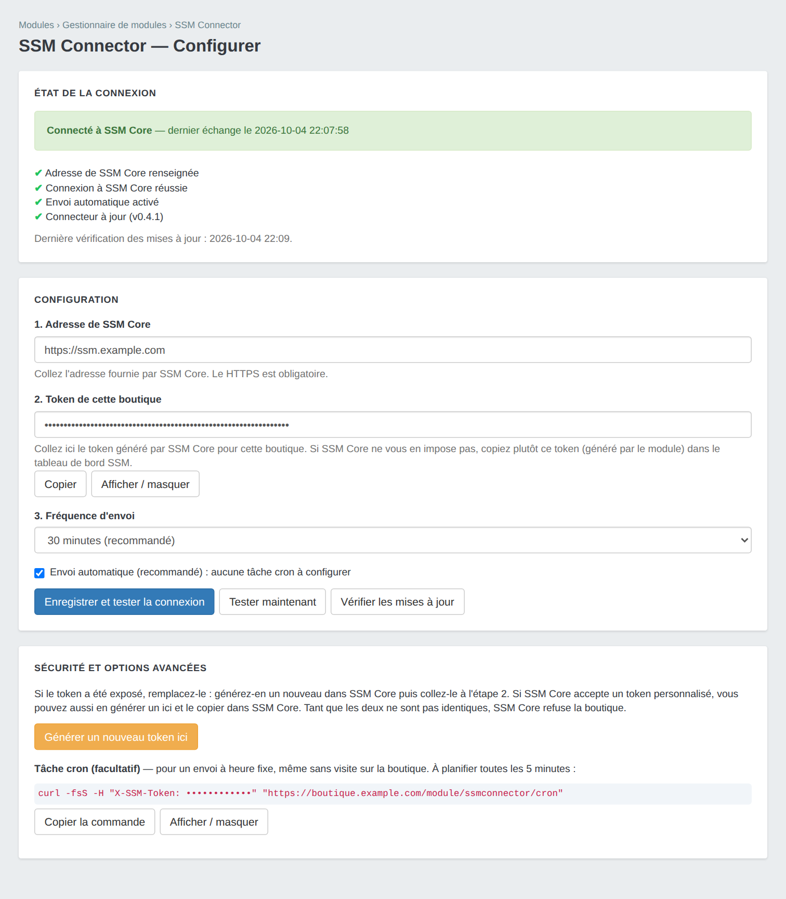
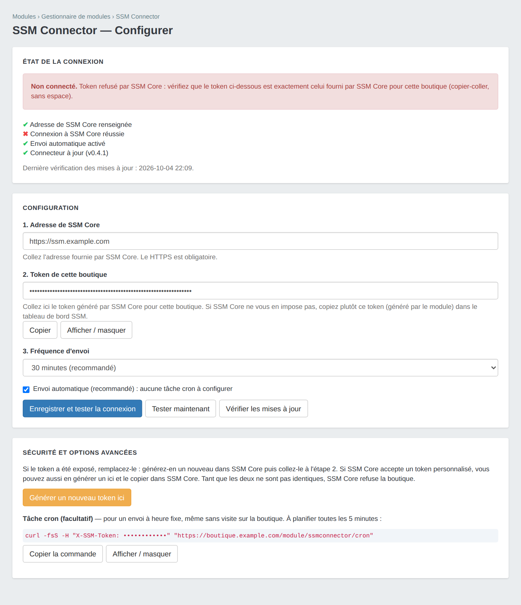

<p align="center"></p>

# SSM Connector — PrestaShop

Module natif PrestaShop (8.x, 9.x visé) qui relie la boutique à **SSM Core** (Selest Site Manager) : il lui envoie l'inventaire (modules, thèmes, versions), des compteurs de base et un journal d'événements. Il ne modifie rien dans la boutique.

Version actuelle : **0.5.0** ([notes de version](CHANGELOG.md))

## Aperçu

Page de configuration du module : trois champs, un test de connexion intégré et un état clair de la connexion.







> Ces aperçus sont le rendu du HTML produit par le module, hors back-office PrestaShop : l'habillage exact dépend du thème d'administration de votre boutique.

## Configuration en 3 étapes

1. **Installer** le module : Back-office → Modules → Gestionnaire de modules → *Téléverser un module*, avec `ssmconnector.zip` de la [dernière release](../../releases/latest).
2. **Dans le tableau de bord SSM**, ajouter la boutique : SSM Core génère un **token** pour elle (*Sites*, bouton **🔌** de la boutique ; il n'est affiché qu'une fois). Copiez-le.
3. **Dans la configuration du module**, collez l'**adresse** de SSM Core (copiée depuis la barre d'adresse du navigateur : seule la partie `https://nom-de-domaine` compte) et le **token**, puis cliquez sur **Enregistrer et tester la connexion**.

Le token se colle tel quel : espaces, retours à la ligne, guillemets et préfixe `Bearer` sont retirés. Il doit compter **32 à 256 caractères**, comme SSM Core l'exige. Il n'est **jamais réaffiché** (seuls les 4 derniers caractères le sont) ; pour le remplacer, générez-en un nouveau dans SSM Core et collez-le.

C'est tout : l'envoi est automatique, sans tâche cron à configurer. La page indique l'état de la connexion ; en cas d'échec, elle explique la cause (adresse introuvable, token refusé, certificat invalide…) et ce qu'il faut corriger.

## Fonctionnement

Le module envoie périodiquement un *heartbeat* (`POST {adresse SSM}/api/v1/heartbeat`, JSON) contenant :

- version de PrestaShop, de PHP (au format `X.Y.Z`) et de la base, serveur web, nom de la machine, chemin d'installation ;
- liste des modules (clé `extensions`) et des thèmes : identifiant, nom, version, actif / inactif ;
- **état de la boutique**, lu par SSM Core depuis la 2.7.0 : mode debug, mode maintenance, SSL, multiboutique, URL de la boutique ;
- **compteurs métier** : clients, produits, commandes, employés (avec leur évolution quotidienne côté SSM) ;
- **version du connecteur** : `connector_version`, `latest_connector_version`, `connector_update_available`.

Tous les champs sont tronqués aux limites de SSM Core : un champ trop long ferait refuser **tout** l'inventaire en 422, pas seulement lui.

Les événements (connexion réussie d'un client, tentatives de connexion, commandes, mises à jour produit, installation / désinstallation de module) sont **désactivés par défaut**. SSM Core ne les exploite pas encore — son schéma les ignore volontairement — alors que la file contient des identifiants de personnes. La case « Envoyer les événements » permet de les réactiver si SSM Core venait à les consommer ; elle est off par défaut, y compris à l'installation, et la decocher vide la file. Tant qu'elle est cochée : seulement des identifiants, jamais d'adresse e-mail, file limitée à 100 événements, répétitions rapprochées regroupées, vidage après un envoi réussi uniquement. Tant qu'elle est décochée, rien n'est écrit en base et rien n'est transmis.

Un badge **SSM: OK / KO** est affiché dans l'en-tête du back-office. La page de configuration indique le numéro de site reconnu par SSM Core — c'est la confirmation que le token collé est bien celui de cette boutique.

### Envoi automatique

L'intervalle se règle dans la configuration (5 minutes à 24 heures, 30 minutes par défaut). L'envoi est déclenché par les pages vues, sans cron :

- côté **boutique**, l'envoi a lieu *après* la réponse au visiteur (PHP-FPM), donc sans jamais le ralentir ; sans PHP-FPM, la boutique ne déclenche rien ;
- côté **back-office**, l'envoi est déclenché à l'ouverture d'une page d'administration ;
- un verrou évite les envois simultanés ; après un échec, un nouvel essai a lieu au plus tard 5 minutes plus tard.

### Tâche cron (facultatif)

Pour un envoi à heure fixe, même sans visite, planifier toutes les 5 minutes (la commande est affichée dans la configuration ; **remplacez `VOTRE_TOKEN` par le token de l'étape 2**, qui n'est jamais écrit dans la page) :

```bash
*/5 * * * * curl -fsS -H "X-SSM-Token: VOTRE_TOKEN" "https://votre-boutique.tld/module/ssmconnector/cron" >/dev/null
```

Le heartbeat n'est envoyé que si l'intervalle configuré est écoulé ; ajouter `?force=1` pour l'envoyer immédiatement. Le token se passe **uniquement dans l'en-tête** : il n'est plus accepté dans l'adresse (changement depuis la 0.3.0).

## Ce que SSM peut demander (0.8.0)

Rien n'est exécuté sans demande de SSM ; le compte rendu part au heartbeat suivant.

| Demande | Ce que fait le module |
|---|---|
| activer, désactiver un module | `Module::enable()` / `disable()` ; jamais le connecteur lui-même |
| sauvegarder la boutique | `database.sql` + fichiers (sans `var/cache`, `var/logs`, images en option) dans un zip déposé sur l'URL pré-signée du stockage S3 de l'agence |

Le module remonte aussi les **erreurs PHP** (fatales, et celles du journal de PHP), chemins relatifs à la boutique.

**Pas encore** : la mise à jour de modules (elle appelait une méthode qui n'existe pas dans PrestaShop et
échouait toujours ; elle n'est plus annoncée à SSM).

## Back-office et connexion directe (0.8.0)

**Adresse du back-office.** PrestaShop renomme le dossier d'administration à l'installation
(`admin4f7k2q`…) : SSM ne peut pas le deviner. Le module transmet l'adresse réelle (`admin_url`). Il la
lit dès qu'un employé ouvre le back-office, sinon il cherche à la racine le dossier qui contient les
fichiers propres au back-office. S'il en trouve plusieurs (copie de sauvegarde du dossier…), il ne
choisit pas : rien n'est transmis tant que le back-office n'a pas été ouvert.

**Connexion directe depuis SSM** : un clic dans SSM ouvre le back-office, sans mot de passe. Elle est
**fermée par défaut**, et SSM ne peut pas l'ouvrir à distance. Pour l'ouvrir, un **super-administrateur**
coche « Autoriser la connexion directe depuis SSM » dans la page du module et choisit l'employé connecté
(par défaut : le premier super-administrateur actif).

La constante, dans `config/defines_custom.inc.php` (fichier conservé par les mises à jour de PrestaShop),
**l'emporte sur la case** : `true` l'ouvre, `false` la verrouille fermée. C'est utile à un hébergeur ou
à un client qui veut l'interdire.

```php
<?php
define('SSM_CONNECTOR_ALLOW_LOGIN', false);   // verrou : fermée, case grisée
// facultatif, prioritaire sur le choix de la page du module
define('SSM_CONNECTOR_LOGIN_EMPLOYEE', 'email@employe.fr');
```

Au heartbeat suivant, SSM remet au module une clé propre à la boutique, qui est stockée chiffrée. Un
heartbeat plus tard, la connexion est prête. Chaque lien est signé avec cette clé, valable 60 secondes
et **une seule fois**. Il ouvre la session de l'employé désigné par la boutique, jamais un compte
choisi par SSM, y compris en mode maintenance. Chaque connexion est inscrite dans les journaux de
PrestaShop (« Connexion au back-office depuis SSM ») et dans la page du module. Décocher la case (ou
poser la constante à `false`) referme la porte et efface la clé.

## Sécurité

- **HTTPS obligatoire** : l'adresse de SSM Core doit commencer par `https://` (`http://` n'est toléré que pour `localhost` et `127.0.0.1`). Le certificat est vérifié et les redirections ne sont **pas** suivies, pour que le token ne parte jamais vers une autre adresse.
- **Token** : celui que SSM Core a généré pour la boutique (le module n'en invente plus). Il est saisi dans un champ masqué, **jamais réécrit dans la page** (4 derniers caractères seulement), jamais cité dans un message d'erreur, et envoyé dans l'en-tête `X-SSM-Token` de chaque envoi. Seuls les caractères ASCII visibles sont acceptés (32 à 256), ce qui exclut toute injection dans les en-têtes HTTP.
- **Point d'entrée cron** : token en en-tête uniquement, comparaison à temps constant, **blocage 15 minutes après 10 échecs** depuis la même adresse IP (réponse `429`). L'adresse IP n'est jamais stockée en clair, seulement son condensat.
- **Back-office** : chaque action de la page de configuration est protégée par un jeton anti-CSRF propre à l'employé, en plus de celui de PrestaShop ; toutes les sorties sont échappées, y compris les messages d'erreur construits à partir d'une réponse du serveur. L'accès à la page reste régi par les droits PrestaShop sur les modules.
- **Données envoyées** : voir la liste ci-dessus. Aucun mot de passe, aucun contenu de commande, aucune donnée client : seulement des identifiants (n° de client, de commande, de produit) et des compteurs — et les identifiants seulement si l'envoi d'événements a été activé.

Limites à connaître :

- le token est stocké **en clair** dans la table de configuration de PrestaShop (le chiffrer n'a pas été testé sur une vraie boutique) : protégez l'accès à la base de données ;
- si la boutique est derrière un proxy qui masque l'adresse du visiteur, les échecs du point d'entrée cron sont comptés pour l'adresse du proxy : dix essais ratés de n'importe qui bloquent alors ce point d'entrée 15 minutes (l'envoi automatique n'est pas concerné) ;
- il n'y a ni OAuth2 ni liste blanche d'adresses IP ;
- sans PHP-FPM, l'envoi automatique déclenché depuis une page du back-office peut la retenir quelques secondes (délai limité à 5 s) si SSM Core répond lentement.

## Compatibilité

- PrestaShop 8.0 minimum (9.x visé)
- PHP 8.1 minimum, extension cURL
- Multiboutique : la configuration suit le contexte de boutique

## Mise à jour du connecteur

**Détection.** Le module compare sa version à la dernière release GitHub de ce dépôt (au plus une vérification toutes les 12 h, ou à la demande via « Vérifier les mises à jour »). Quand une version plus récente existe, la page de configuration affiche un bandeau avec le lien de téléchargement et les notes de version, et le heartbeat transmet `latest_connector_version` et `connector_update_available` à SSM Core. La vérification est une simple requête publique vers `api.github.com` : aucune donnée de la boutique n'est envoyée. Une indisponibilité de GitHub n'a aucun effet sur le fonctionnement du module.

**Installation de la mise à jour.** Elle reste manuelle : remplacer le dossier `modules/ssmconnector/` par le contenu de `ssmconnector.zip`, puis lancer la mise à jour du module dans le gestionnaire de modules. Les scripts du dossier `upgrade/` s'exécutent alors (ils ajoutent les réglages manquants, enregistrent les hooks et réparent la file d'événements). Le token et la configuration sont conservés.

**Publier une version** (mainteneurs) : mettre à jour la version dans `ssmconnector.php` (en-tête et `$this->version`), `config.xml` et `ssmconnector.txt`, ajouter `upgrade/upgrade-X.Y.Z.php` et la section de `CHANGELOG.md`, fusionner dans `main`, puis au choix :

- depuis GitHub : *Actions → Release → Run workflow* avec le numéro de version (sur `main`) : le workflow crée lui-même le tag et la release ;
- en ligne de commande : `git tag vX.Y.Z && git push origin vX.Y.Z` ;
- depuis l'interface GitHub : *Releases → Draft a new release*, créer le tag `vX.Y.Z` sur `main`, puis *Publish release*.

Dans les deux cas, le workflow `.github/workflows/release.yml` vérifie la syntaxe PHP, exécute les tests, contrôle que le tag correspond à la version du module, construit `ssmconnector.zip` (dossier racine `ssmconnector/`) et le joint à la release (qu'il crée si elle n'existe pas, avec la section correspondante de `CHANGELOG.md` comme notes). Une release publiée sans archive après un échec du workflow se corrige en relançant le job depuis l'onglet Actions.

## Développement

```bash
find . -name '*.php' -not -path './.git/*' -exec php -l {} \;   # syntaxe
php tests/run.php                                                # tests (faux PrestaShop + faux SSM Core local)
php tests/preview.php /tmp/apercus                               # pages HTML des aperçus (habillage : docs/preview/preview.css)
```

Les tests s'exécutent sans PrestaShop : un faux environnement charge le module, produit son inventaire, sa page de configuration et envoie vraiment ses requêtes HTTP à un faux SSM Core. Ils ne remplacent pas un essai sur une vraie boutique (installation, mise à jour, affichage du back-office).

## Licence

[MIT](LICENSE) © Selest Informatique
